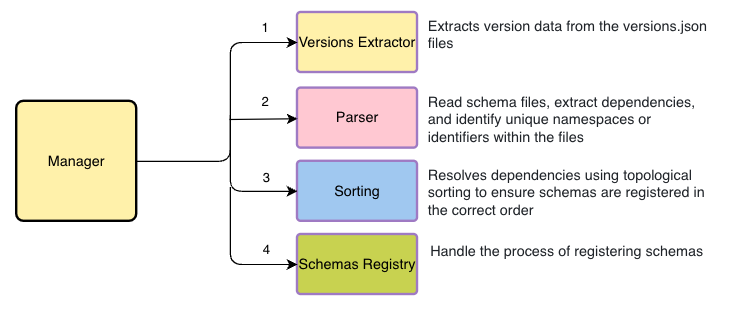

# Schema Manager Overview

The Schema Manager is a tool designed to handle the registration of schemas within a schema registry service. It employs an **Orchestrator Pattern**, where the **Manager** class acts as the conductor, ensuring that schema dependencies are resolved, and schemas are registered in the correct sequence.

This document outlines the key components and flow of the schema registration process, as well as instructions for extending the system to support various schema types and registries.

---

## **Diagram**

Here’s a high-level flow of the schema registration process:



---

## **Flow of the Registration Process**

The registration process consists of four main steps, each handled by specific components of the Schema Manager:

1. **Versions Extractor**

   - **Responsibility**: Extracts version data from the `versions.json` files in a given directory.
   - **Note**: This component is **not designed to be extended**, as the process should remain consistent across all schema registries and schema types.

2. **Parser**

   - **Responsibility**: Reads schema files, extracts dependencies, and identifies unique namespaces or identifiers within the files.
   - **Extendable**: The parser is designed to be customizable, allowing developers to implement support for different schema types.

   See: [How to Create a Parser](create-parser.md) for more details.

3. **Sorting**

   - **Responsibility**: Builds a dependency graph and resolves dependencies using topological sorting to ensure schemas are registered in the correct order.
   - **Note**: This component is **not designed to be extended**, as the sorting process is universally applicable and doesn't require customization.

4. **Schemas Registry**

   - **Responsibility**: Handles the actual process of registering the schemas within the schema registry.
   - **Extendable**: Like the parser, the registry component is designed for extension, allowing developers to implement support for various schema registry services.

   See: [How to Create a Registry](create-registry.md) for more details.

---

## **Extensibility**

Both the **Parser** and **Schemas Registry** components are designed to be extended. These components can be customized to support different types of schemas or integrate with various schema registries. The sorting and version extraction components, on the other hand, remain fixed as they are universal to all schema management scenarios.

- To extend the parser, follow the guide: [create-parser.md](create-parser.md)
- To extend the registry, follow the guide: [create-registry.md](create-registry.md)

---

## **Detailed Input Output\***

Consider a similar example as the one specified in the [Scenario Example](README.md#scenario-example) section in the README.

```bash
example-schemas/
  ├── topic1/
  │   ├── v1/
  │   │   ├── data.proto         # Schema for v1 data of topic1
  │   │   └── model.proto        # Schema for v1 model (depends on topic1/v1/data.proto)
  │   ├── v2/
  │   │   └── data.proto         # Schema for v2 data (depends on ./common/v1/entity.proto)
  │   └── versions.json          # Version mapping for topic1 (v1 and v2)
  ├── common/
  │   ├── v1/
  │   │   └── entity.proto       # Schema for test entity
```

**versions.json for topic1:**

```json
{
  "v1": {
    "data": "v1/data.proto",
    "model": "v1/model.proto"
  },
  "v2": {
    "data": "v2/data.proto",
    "model": "v1/model.proto",
    "entity": "../common/v1/entity.proto"
  }
}
```

### Versions Extraction Output

The versions extraction will return the following objects:

```typescript
// FileMap (Map of file path to an array of version objects). version is the key in the versions.json file and full is directory of the versions.json with the key at the end {directory}/{version}
Map(6) {
  'common/v1/entity.proto' => [
    { version: 'v2', full: 'topic1/v2' }
  ],
  'topic1/v1/data.proto' => [ { version: 'v1', full: 'topic1/v1' } ],
  'topic1/v1/model.proto' => [
    { version: 'v1', full: 'topic1/v1' },
    { version: 'v2', full: 'topic1/v2' }
  ],
  'topic1/v2/data.proto' => [ { version: 'v2', full: 'topic1/v2' } ],
}

// VersionMap (Map of version directories + version name {directory}/{version}, to their mapping)
Map(5) {
  'topic1/v1' => Map(2) {
    'data' => 'topic1/v1/data.proto',
    'model' => 'topic1/v1/model.proto'
  },
  'topic1/v2' => Map(3) {
    'data' => 'topic1/v2/data.proto',
    'model' => 'topic1/v1/model.proto',
    'entity' => 'common/v1/entity.proto'
  }
}
```

### Parser Output

```typescript
{
  // Used to map each file to all its dependencies, this is used to order the file registration
  dependenciesMap: Map(6) {
    'common/v1/entity.proto' => [],
    'topic1/v1/data.proto' => [],
    'topic1/v1/model.proto' => [ 'topic1/v1/data.proto', 'topic1/v2/data.proto' ],
    'topic1/v2/data.proto' => [ 'common/v1/entity.proto' ]
  },
  // Used to map each file to its fully qualified namespace or identifier, this is used to format the dependency names for the registry
  namespaceMap: Map(6) {
    'common/v1/entity.proto' => 'common.Entity',
    'topic1/v1/data.proto' => 'topic1.Data',
    'topic1/v1/model.proto' => 'topic1.Model',
    'topic1/v2/data.proto' => 'topic1.Data'
  },
  // Used to map each file to a map of versions and their specific dependencies, topic1/v1/model.proto has two versions for the same file meaning that two different schemas need to be registered for the same file
  dependenciesPartionnedMap: Map(6) {
    'common/v1/entity.proto' => Map(2) { 'topic1/v2' => [] },
    'topic1/v1/data.proto' => Map(1) { 'topic1/v1' => [] },
    'topic1/v1/model.proto' => Map(2) { 'topic1/v1' => [Array], 'topic1/v2' => [Array] },
    'topic1/v2/data.proto' => Map(1) { 'topic1/v2' => [Array] }
  }
}
```

### Topological Sorting Output

The topological sorting will return the following array:

```typescript
['common/v1/entity.proto', 'topic1/v1/data.proto', 'topic1/v2/data.proto', 'topic1/v1/model.proto'];
```

### Manager

The Manager will then use the array from the topological sorting output, along with the `namespaceMap` and `dependenciesPartitionedMap` from the Parser output, to publish the schemas
