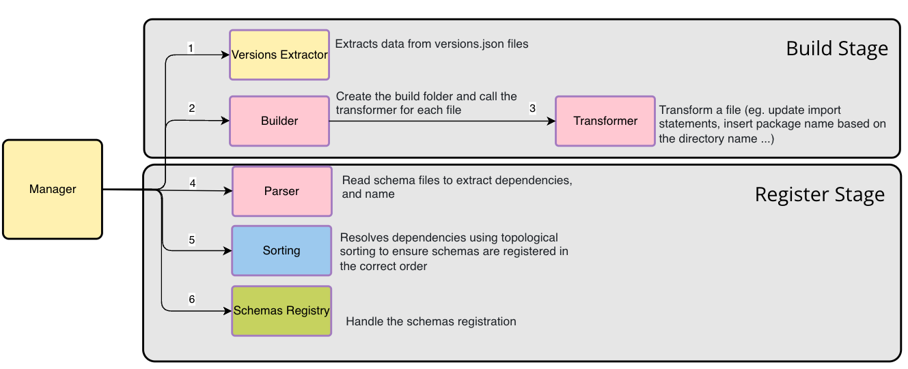

# Schema Manager Overview

The Schema Manager is a tool designed to handle the registration of schemas within a schema registry service. It employs an **Orchestrator Pattern**, where the **Manager** class acts as the conductor, ensuring that schema dependencies are resolved, and schemas are registered in the correct sequence.

This document outlines the key components and flow of the schema registration process, as well as instructions for extending the system to support various schema types and registries.

---

## **Flow of the Registration Process**

The registration process consists of four main steps, each handled by specific components of the Schema Manager:

1. **Versions Extractor**

   - **Responsibility**: Extracts version data from the `versions.json` files in a given directory.
   - **Note**: This component is **not designed to be extended**, as the process should remain consistent across all schema registries and schema types.

2. **Parser**

   - **Responsibility**: Reads schema files, extracts dependencies, and identifies unique namespaces or identifiers within the files.
   - **Extendable**: The parser is designed to be customizable, allowing developers to implement support for different schema types.

   See: [How to Create a Parser](create-parser.md) for more details.

3. **Sorting**

   - **Responsibility**: Builds a dependency graph and resolves dependencies using topological sorting to ensure schemas are registered in the correct order.
   - **Note**: This component is **not designed to be extended**, as the sorting process is universally applicable and doesn't require customization.

4. **Schemas Registry**

   - **Responsibility**: Handles the actual process of registering the schemas within the schema registry.
   - **Extendable**: Like the parser, the registry component is designed for extension, allowing developers to implement support for various schema registry services.

   See: [How to Create a Registry](create-registry.md) for more details.

## **Diagram**

Here’s a high-level flow of the schema registration process:

---

## **Extensibility**

Both the **Parser** and **Schemas Registry** components are designed to be extended. These components can be customized to support different types of schemas or integrate with various schema registries. The sorting and version extraction components, on the other hand, remain fixed as they are universal to all schema management scenarios.

- To extend the parser, follow the guide: [create-parser.md](create-parser.md)
- To extend the registry, follow the guide: [create-registry.md](create-registry.md)

---
